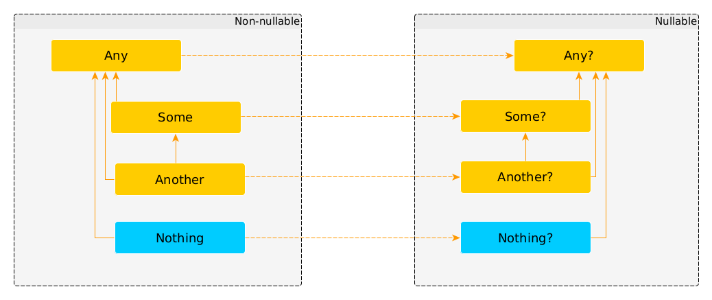

<!--
_backgroundImage: "linear-gradient(to bottom, #000 0%, #1a2028 50%, #293845 100%)"
_class: lead
_paginate: false
_footer: ""
-->

<style>
footer {
    display: table
}
.hljs-variable { color: lightblue }
.hljs-string { color: lightgreen }
.hljs-params { color: lightpink }

pre, pre[class*="language-"] {
  white-space: pre-wrap;
  word-break: break-word;
  margin: 30px 0;
  color: white;
  overflow: auto;
}

.highlighted-line {
  background-color: #14161a;
  display: block;
}
</style>


# Love to Frankenstein's monster:
# Kotlin for Apache Spark

Pasha Finkelshteyn, JetBrains

---

# Vanity fair

- 14 years in IT
- 11 years in development
    - Developer
    - Team Lead and even CTO (O_o)
- 1 year in data engineering
- And now building tools for data engineers at JetBrains :heart:

[Big Data Tools](https://plugins.jetbrains.com/plugin/12494-big-data-tools)

---
<!-- _class: lead -->
# <!-- fit --> I :heart:

---

# Story of my love with Kotlin

- Used ot in production several weeks before first release
- Was first adopter in Sberbank's production
- Giving talks on it
- Trying to use it **EVERYWHERE**

---

# My story with data engineering

Data engineering is all about Java, Python and Scala.

And of course I've started with Scala — it's native!

But soon I realized that lots of things could be easier with Kotlin!

---

# Kotlin key benefits

- JVM
- `null`-aware and null-safe type system
- Extension methods (and values)
- Reified generics
- DSL-building abilities
- Compatible (?) with other JVM ecosystem languages

---

# Note on null-aware type system



---

# Note on null-aware type system 

```kotlin {1,4-5}
class Z

fun main(){
    val nullZ: Z? = null
    val z = Z()
    println(nullZ is Z)  // false
    println(z is Z)      // true
    println(nullZ is Z?) // true
    println(z is Z?)     // true
}
```

---

# Note on null-aware type system 

```kotlin {1,4-6}
class Z

fun main(){
    val nullZ: Z? = null
    val z = Z()
    println(nullZ is Z)  // false
    println(z is Z)      // true
    println(nullZ is Z?) // true
    println(z is Z?)     // true
}
```

---

# Note on null-aware type system 

```kotlin {1,4-5,7-9}
class Z

fun main(){
    val nullZ: Z? = null
    val z = Z()
    println(nullZ is Z)  // false
    println(z is Z)      // true
    println(nullZ is Z?) // true
    println(z is Z?)     // true
}
```

---

# Extension methods

```kotlin
fun Iterable<Int>.sum() = reduce { a, b -> a + b }
```
This :arrow_up: already exists in stdlib

---

# Reified generics

* Generics on JVM **can't** be reified. Ever.
* But there are *inline* methods in Kotlin. They will be inlined at runtime:
    ```kotlin
    inline fun runIt(func: () -> Unit) = func()
    ```
* And if method is inlined we can reify generic at call site!
    ```kotlin
    inline fun <reified T> callIt(func: () -> T): T = func()
    ```

---

# DSL-building

Extension functions in conjunction with functional arguments allow us following magic:

```kotlin
fun html(init: HTML.() -> Unit): HTML {
    val result = HTML()
    HTML.init() // or return HTML().apply { init () }
    return result
}
fun HTML.h1(text:String) = addElement("<h1>$text<h1>")
html { h1("Example") }
```

---


# And the journey begins

---

# I mean


---

# <!-- fit --> But why Frankenstein's?
# <!-- fit --> And why monster?

1. It looks alike my surname
1. We need to crossbreed Kotlin and Scala to produce something with best parts of both worlds!
1. And at the start of experiment we don't have any idea on its behavior!

